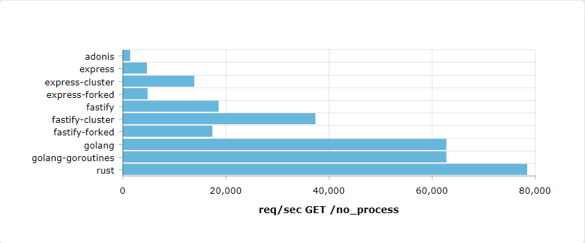

### Results

After running the benchmark, you can find results in the 'results' folder. [You can find an example here.](results)

These results will depend of your environment.

Example of result, requests/second :

---

### Abstract

Benchmark the capacity of certain technologies to process HTTP requests requiring significant processor calculations.

---

### Methodology

Projects serve two endpoints on port 3000 :

`GET /no_process`
`GET /heavy_process`

These endpoints perform -or not- a job that require significant resources. We use the [wrk tool](https://github.com/giltene/wrk2) to test each project and collect results.

---

### Start

`./run.sh`
